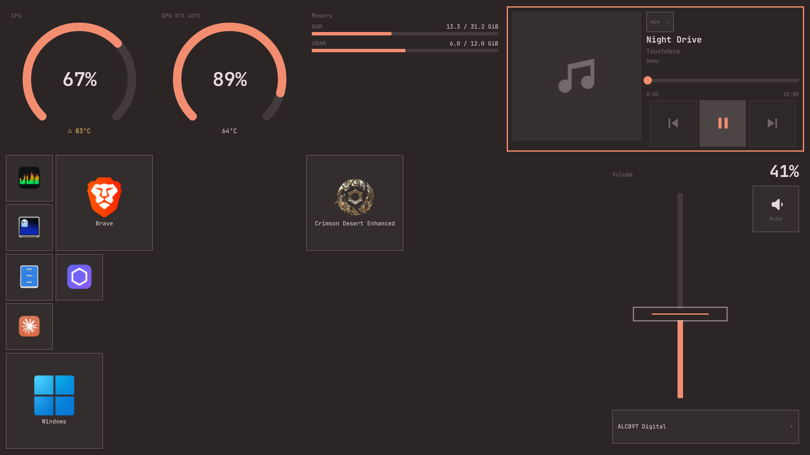
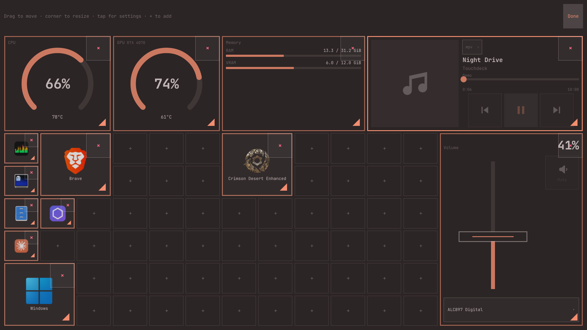
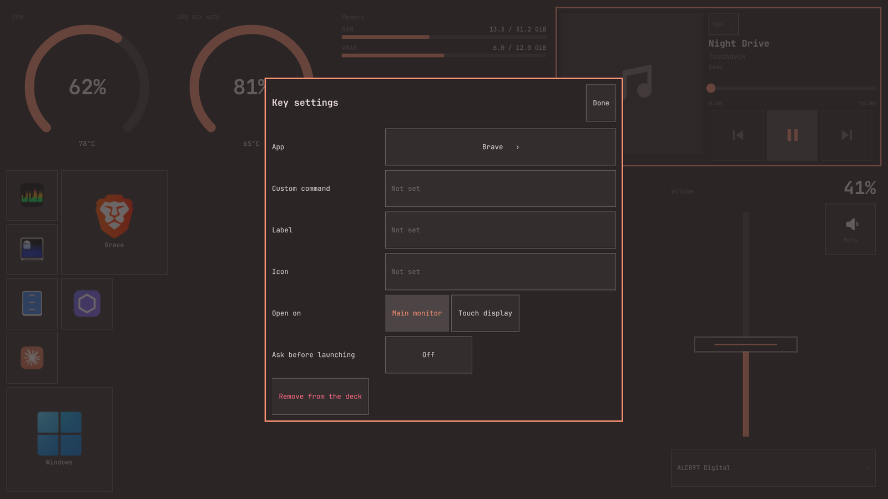
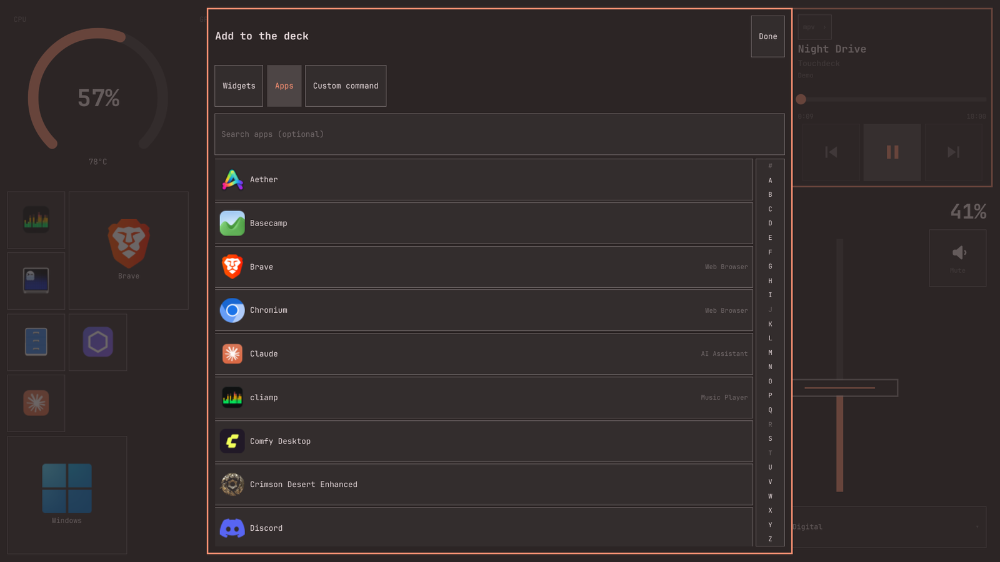

# Touchdeck

A touch launchpad and system deck for a second, touch-screen display on
[Omarchy](https://omarchy.org). It runs inside Omarchy's own shell as a plugin, so it
follows your theme, font and text size exactly, and it costs under 1 % of one CPU core.



- **App keys**: big, pressable keys that open apps on your *main* monitor, not under
  the deck.
- **CPU and GPU**: usage gauges with temperatures, plus GPU junction temperature and
  fan speed where the card reports them. NVIDIA through `nvidia-smi`; AMD and
  Intel through sysfs.
- **Memory**: RAM, VRAM and optionally swap.
- **Volume**: a fader, mute, mic mute and output switching, in step with your volume
  keys.
- **Media**: now playing for any MPRIS player (Spotify, browsers, mpv), with seek.
- **Edit mode**: rearrange, resize, add and remove everything by touch. No typing is
  needed.
- **Bar button**: show or hide the deck from the Omarchy bar; right click opens it
  straight into edit mode.

## Requirements

- Omarchy 4 with `omarchy-shell` (built and tested on 4.0.0.alpha: Hyprland 0.56.2
  with its Lua config, Quickshell 0.3.1).
- A second display with a touch screen.
- `curl`, `jq`, `gtk-launch` (gtk3), `uwsm` and `xdg-utils`. All ship with Omarchy.
- `nvidia-smi` for NVIDIA GPU readings (optional).

## Install

```sh
omarchy plugin add <git-url> --enable
omarchy-restart-shell
```

The deck starts on the touch display at every login; there's no autostart line to add,
and a button for it appears in the bar.

Tell it which display is the touch screen. Open `~/.config/touchdeck/config.json`
(created on first run) and set `display.match`:

```jsonc
"display": {
  "match": { "by": "name", "value": "HDMI-A-1" }   // a connector from `hyprctl monitors`
  // or { "by": "description", "value": "Verbatim" }: part of the display's model name
}
```

The deck applies it at once. Until something matches, `status` (see below) says
what it's looking for.

### Map touches to the touch display

Without this, touches land on the wrong screen. In `~/.config/hypr/input.lua`:

```lua
hl.config({ input = { touchdevice = { output = "HDMI-A-1" } } })
```

Tap the four corners to check. Omarchy may have done this for you already.

### Optional extras

A keybind to show and hide the deck, in `~/.config/hypr/bindings.lua`.
(`SUPER + CTRL + D` is taken by Omarchy's display panel.)

```lua
o.bind("SUPER + CTRL + SHIFT + D", "Toggle Touchdeck", "omarchy-shell shell toggle shannon.touchdeck '{}'")
```

Give the touch display a workspace of its own, so windows never open underneath the
deck:

```lua
hl.workspace_rule({ workspace = "10", monitor = "HDMI-A-1", default = true })
```

## Using it

- **Tap** a key to open its app. It opens on the monitor you were last working on.
- **Hold** anywhere for about a second, or **right-click**, for a small menu: *Edit
  layout*, and that item's settings.
- **In edit mode**:
  - drag a tile to move it;
  - drag its bottom-right corner to resize it;
  - **×** removes it, with five seconds to undo;
  - tap it for its settings;
  - tap an empty **+** cell to add a widget, an app (browse with the A–Z strip) or a
    custom command.

  Tap **Done**, or leave it alone for a minute, to finish. Every change is saved as
  you go.

### The bar button

Touchdeck also installs a widget in the Omarchy bar, so the deck can be shown and
hidden from the main monitor:

- **Left click** shows or hides the deck.
- **Right click** opens it in edit mode.
- The icon takes the bar's active colour while the deck is on screen, however it was
  opened — the button, a keybind, or IPC.

Move it like any other widget (`omarchy bar move shannon.touchdeck --section center`).
Its place in the bar *is* this plugin's entry in `shell.json`, so removing the button
from the bar switches the whole plugin off; put it back with:

```sh
omarchy plugin enable shannon.touchdeck --section right
```



 

## Escape hatch

If the deck ever misbehaves, turn it off. The rest of the shell (bar, notifications,
lock screen) carries on:

```sh
omarchy plugin disable shannon.touchdeck
omarchy-restart-shell
```

`omarchy plugin enable shannon.touchdeck` brings it back.

## Removing it

```sh
omarchy plugin remove shannon.touchdeck --yes
```

Your layout stays at `~/.config/touchdeck/` in case you reinstall; delete that folder
to remove every trace.

## Dependencies and privileges

- It runs **inside** `omarchy-shell`, as unsandboxed QML, like every shell plugin. It
  asks for no root: no `sudo`, no polkit, no system services, no system files written.
- **Reads**: `/proc` and `/sys` for CPU, memory and GPU readings; your desktop entries
  for app keys.
- **Writes**: `~/.config/touchdeck/config.json` (plus a `.bak`), and cached album art
  under `$XDG_RUNTIME_DIR/touchdeck/`, which is memory-backed and cleared on logout.
- **Helper processes**, each started only while something on screen needs it:
  - `bin/touchdeck-collect` — reads `/proc` and `/sys` on a timer;
  - `nvidia-smi` — NVIDIA readings, if installed;
  - `bin/touchdeck-art` — `curl`s the current track's cover art from whatever URL the
    media player publishes. This is the plugin's only network access, and it happens
    outside the shell process on purpose (see `docs/DECISIONS.md` D-46);
  - `bin/touchdeck-launch` — `uwsm-app` / `gtk-launch` to start apps, and `hyprctl` to
    move focus;
  - `bin/touchdeck-defaults` — `xdg-settings` / `xdg-mime`, once, to fill the first
    three app keys.
- **No telemetry**, and nothing is uploaded anywhere.

## Configuration

Everything lives in `~/.config/touchdeck/config.json`. Edit mode writes it for you,
and hand edits apply live.

- If the file becomes invalid JSON, the deck keeps its last good layout, shows a
  banner naming the line, and writes nothing until you fix it.
- It keeps the last good copy in `config.json.bak`.
- Settings it doesn't know are preserved.

| Key | Default | What it does |
|---|---|---|
| `display.match` | description `Verbatim` | Which display is the deck's (see Install) |
| `display.layer` | `top` | `top`, `overlay`, `bottom` or `background`. On `bottom`/`background`, windows can cover the deck, and focus isn't handed back after a touch |
| `display.startVisible` | `true` | Show the deck at login |
| `appearance.columns`, `rows` | `16`, `9` | The grid. Items that no longer fit are parked, never deleted |
| `appearance.scale` | `1.0` | Bigger or smaller type and spacing on the deck |
| `appearance.reduceMotion` | `false` | No animation at all. Also on whenever Hyprland's `animations.enabled` is false |
| `sensors.intervalMs` | `1000` | How often CPU, GPU and memory update |
| `launch.restoreFocus` | `true` | After a touch, hand keyboard focus back to your main monitor |
| `pages[0].items` | a default layout | The layout: `{ id, type, col, row, w, h, settings }` |

Widget settings (also in each widget's settings sheet):

| Type | Settings |
|---|---|
| `app` | `desktopId` (e.g. `"brave-browser.desktop"`), or `command`; `label`, `icon`, `target` (`auto` = main monitor, `touch` = the touch display), `confirm` |
| `cpu` | `tempWarn`, `tempCrit` (°C) |
| `gpu` | `gpu` (`auto`, or a PCI address), `tempWarn`, `tempCrit` |
| `memory` | `showSwap`, `vramGpu` (`auto`, a PCI address or `none`) |
| `volume` | `maxVolume` (up to 1.5), `showMic`, `step` (mouse wheel) |
| `media` | `preferredPlayer` (e.g. `spotify`: preferred when several are open, with an "Open" button when none is) |

## Scripting

```sh
omarchy-shell shell summon shannon.touchdeck '{}'             # show
omarchy-shell shell summon shannon.touchdeck '{"edit":true}'  # show, in edit mode
omarchy-shell shell hide   shannon.touchdeck
omarchy-shell shell toggle shannon.touchdeck '{}'
omarchy-shell shell call   shannon.touchdeck toggleEdit ''
omarchy-shell shell call   shannon.touchdeck status ''        # JSON: display, helpers, config health
omarchy-shell shell call   shannon.touchdeck intent '{"do":"mute"}'
```

`intent` runs anything the deck's own controls do: `volume`, `mute`, `mic`, `output`,
`play-pause`, `next`, `previous`, `seek`, `launch`, and every edit operation. See
`docs/TESTING.md`.

## Troubleshooting

- **Nothing on the touch display.** Run `status`: `dormantReason` says which display
  it's looking for. Check `display.match`.
- **Apps open on the touch display.** Keep `launch.restoreFocus` on, and consider the
  workspace rule above.
- **A banner at the top of the deck.** It names the problem in `config.json`, or says
  how many items are parked because they no longer fit. Edit mode lists the parked
  items so you can place them.
- **Logs**: `qs log -p "$OMARCHY_PATH/shell" --tail 100 | grep -i touchdeck`.

## Development

The repository is the plugin folder. `tools/check.sh` is the quality gate (manifest,
qmllint, about 170 unit tests including a QML-engine parity check, and style guards).
Install a working copy with:

```sh
tools/check.sh \
  && rsync -a --delete --exclude .git --exclude docs ./ ~/.config/omarchy/plugins/shannon.touchdeck/ \
  && omarchy-restart-shell
```

- `docs/DESIGN.md` is the design.
- `docs/DECISIONS.md` has what was found on real hardware and why things are the way
  they are.
- `docs/TESTING.md` has the manual checklist.

## License

MIT. See [LICENSE](LICENSE).
